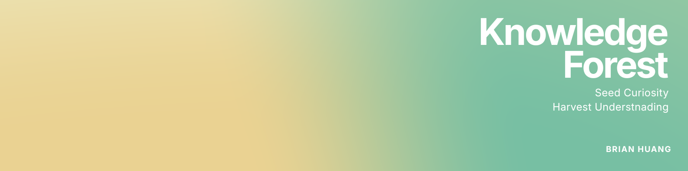

# Knowledge Forest

> **Seed Curiosity. Harvest Understanding.**

## About Us

In an era defined by exponential technological change, we face a paradox: information is everywhere, but **understanding is scarce**. Too often knowledge arrives as isolated data points — static walls of text, passive lectures — that never take root. The result is a structural gap: brilliant potential lost not for lack of intelligence, but for lack of access to the right cognitive tools. This is not just an education problem; it is a systemic inefficiency in how human capital is grown.

I grew up in a rural district in Kaohsiung where modern education and technology never quite reached. I watched how much a child's path bends on the schooling they can — or can't — access, and I learned early that **knowledge is the single biggest lever on where a life can go.** The name of my home "Great Tree" became the whole thesis: plant a seed of knowledge in the soil, and one day it grows into a tree — and many trees into a forest, standing in people's minds.

**Knowledge Forest** is that act of planting, built on one thesis: *knowledge must behave like an ecosystem, not a warehouse.* A single tree gives shade; a **forest** is a resilient, interconnected system where roots reinforce one another. We turn complex technology into concepts that are **visible, playable, and connected** — so understanding compounds. When one concept links to the next, knowledge gains a **network effect**: mastery means seeing the forest behind the trees, not just *what* a tool does but *how* it connects to everything else.

We are not scaling content. We are scaling **capability** — the "zero to one" moment when a learner shifts from passive consumption to active creation. By democratizing systems-based thinking, we don't just teach people to use tools; we give them the soil to build the future. This is **equity of opportunity**, for anyone, anywhere — especially the kid in a place like Dashu, who deserves a modern education the world didn't hand them.
